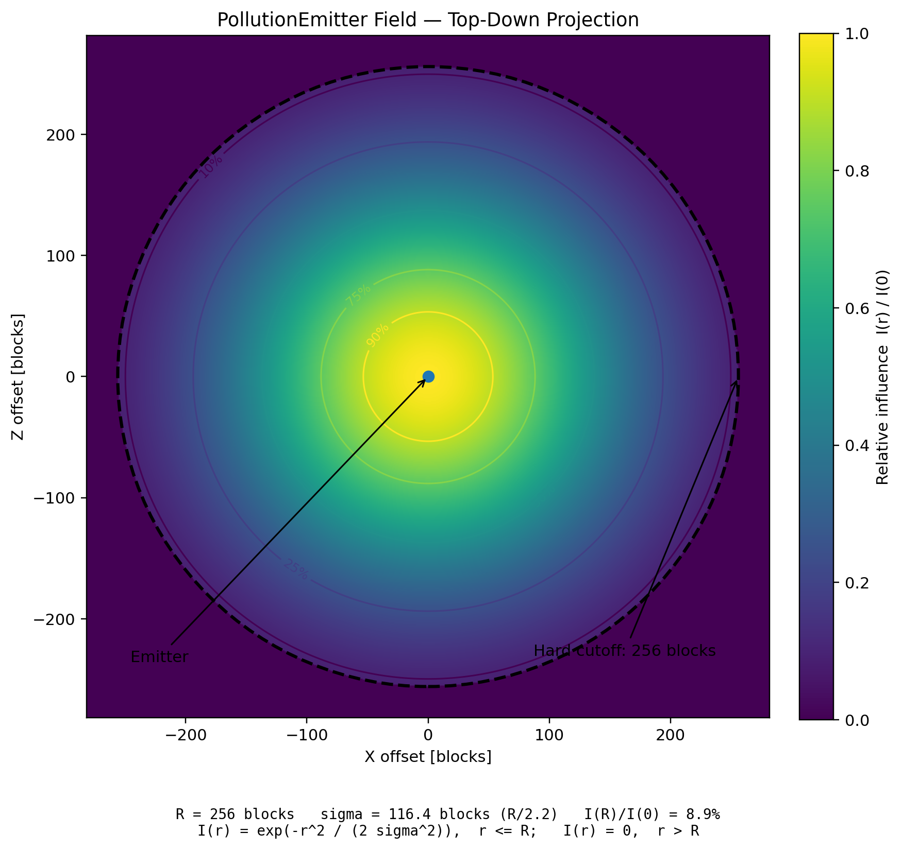

# GT5U Pollution Propagation Rework

Experimental rework of the pollution propagation system for **GT5-Unofficial / GT New Horizons**.

The current development stage is focused primarily on replacing the old chunk-based pollution propagation with a continuous spatial model.

> **Status:** Work in progress.
> Core propagation and persistence are functional, while synchronization, migration, performance, and propagation extensions are still being developed.

---

## Overview

The original system stores pollution per chunk and spreads it between neighboring chunks.

This rework instead models pollution as a spatial field that can be sampled at an actual world position.

```text
PropagationSource
      ↓
PollutionEmitter
      ↓
PropagationSpatialIndex
      ↓
PollutionManager.sample(position)
```

This removes hard chunk boundaries from the propagation model and allows pollution to vary across X, Y, and Z.

---

## Propagation sources

`PropagationSource` represents something that produces pollution.

### `PollutionSource`

A persistent source intended for machines and other continuous pollution producers.

The current muffler integration uses this path instead of directly modifying chunk pollution.

### `PollutionBurstSource`

A one-shot source used for instant pollution additions and compatibility with existing APIs or legacy data.

After its emission is consumed, the source becomes invalid.

---

## PollutionEmitter

`PollutionEmitter` stores accumulated pollution and produces a spatial pollution field.

Its current responsibilities include:

- collecting emissions from sources;
- storing pollution;
- applying decay;
- calculating spatial influence;
- interacting with propagation modifiers;
- exposing persistent state.

The current field uses a Gaussian-like falloff.



*Example top-down projection. The shown parameters are illustrative rather than final.*

Pollution intensity is highest near the emitter and decreases smoothly with distance.

Field parameters, propagation distances, decay values, and other numeric constants are currently provisional.

---

## Spatial sampling

Pollution can be queried directly at a position:

```java
pollutionManager.sample(position);
```

Only emitters capable of affecting that position are evaluated.

`PropagationSpatialIndex` is used to avoid scanning every emitter in the dimension for every sample.

---

## PropagationInfluencer

`PropagationInfluencer` represents something that modifies an existing pollution field without producing pollution itself.

Possible future uses include:

- fans;
- ventilation;
- airflow;
- other propagation modifiers.

No final gameplay implementation exists yet.

---

## Persistence and migration

Emitter state is persisted through `WorldSavedData`.

Persistent emitters are reconstructed when the world is loaded and registered back into the spatial index.

Existing chunk-based pollution data can also be migrated into the new propagation system.

Migration of the existing `GTChunkAssociatedData` format has been tested, including prevention of repeated imports after world reloads.

Older `GTPOLLUTION` chunk NBT compatibility still requires additional testing.

---

## Client synchronization

The authoritative propagation simulation currently runs on the server.

For compatibility with the existing client pollution renderer, the server temporarily converts samples from the new field into legacy chunk pollution packets.

The planned direction is to synchronize emitter state directly to the client and use the same spatial sampling implementation there.

---

## Current state

### Implemented / tested

- [x] Persistent pollution sources
- [x] One-shot pollution sources
- [x] Spatial pollution emitters
- [x] Continuous 3D sampling
- [x] Gaussian-like falloff
- [x] Spatial indexing
- [x] Pollution accumulation and decay
- [x] Muffler integration
- [x] Server-side persistence
- [x] Persistence across full restart
- [x] Legacy `GTChunkAssociatedData` migration

### Still in development

- [ ] Emitter update scheduling
- [ ] Source lifecycle edge cases
- [ ] Long-term decay behavior
- [ ] Older `GTPOLLUTION` migration
- [ ] Client synchronization
- [ ] Performance with many active emitters

### Planned

- [ ] Direct emitter synchronization to clients
- [ ] Client-side spatial sampling
- [ ] Removal of legacy chunk pollution networking
- [ ] `PropagationInfluencer` implementations
- [ ] Directional airflow
- [ ] Additional emitter types and field shapes
- [ ] Pollution sinks / filtering

---

## Current focus

The current development focus is the propagation layer itself:

- sources;
- emitters;
- spatial sampling;
- persistence;
- synchronization;
- performance.

The goal is to build a propagation system that is continuous, three-dimensional, extensible, persistent, and scalable enough for normal gameplay.

---

## Upstream

Based on **GTNewHorizons / GT5-Unofficial**.

The current work replaces the chunk-oriented pollution propagation layer while retaining compatibility with surrounding GT5U systems during development.
